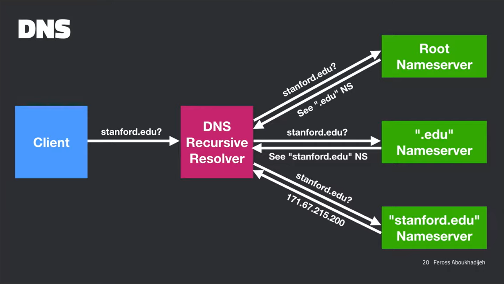

=| Domain Name System - DNS |=
-> Client contacts DNS Server through query, the DNS returns the IP of said domain so that the client can contact the server directly, and the client then sends an HTTP request to the server, and the server sends an HTTP response back to the client
 \-> low-end eg: Client =: google.com > DNS Server =: 172.53.642.234 > Client
 \-> 
